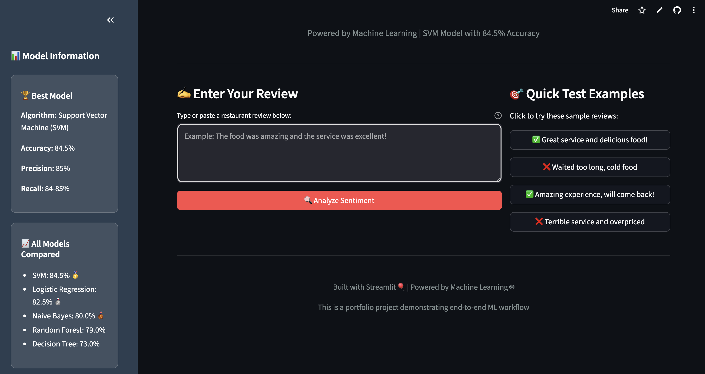
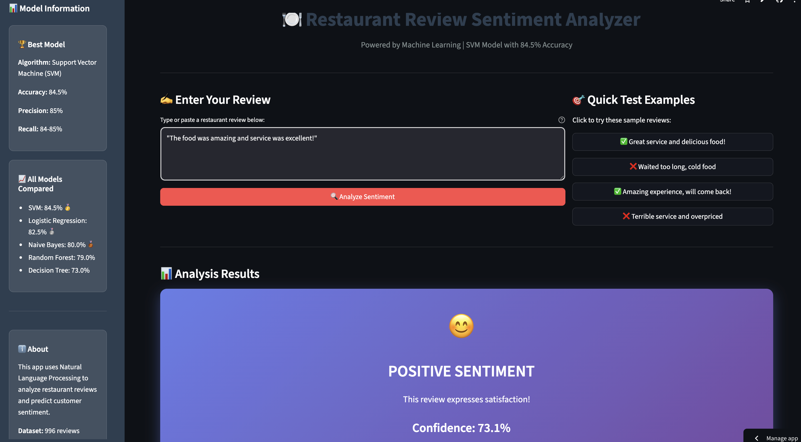
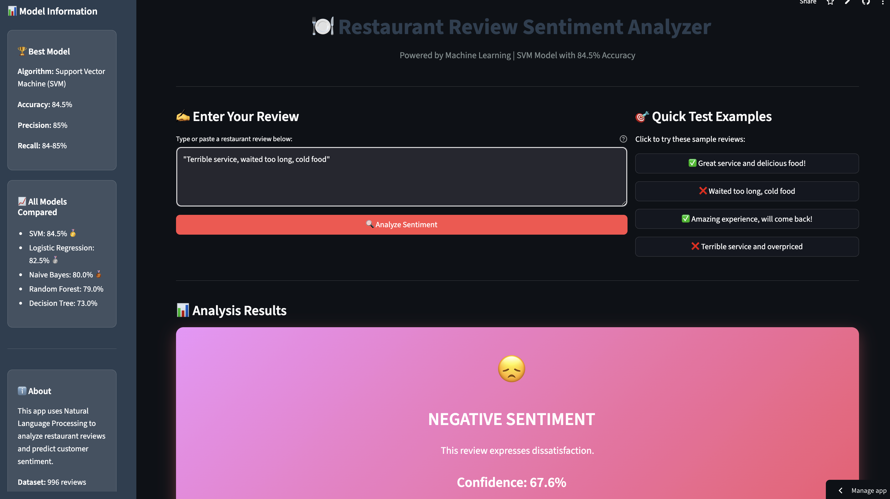
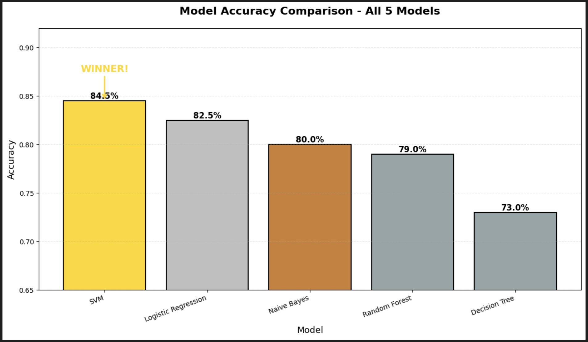
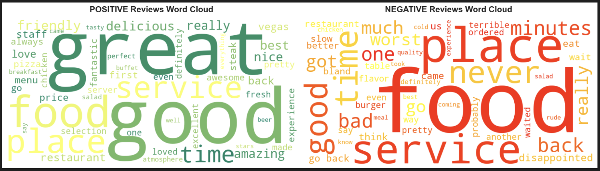
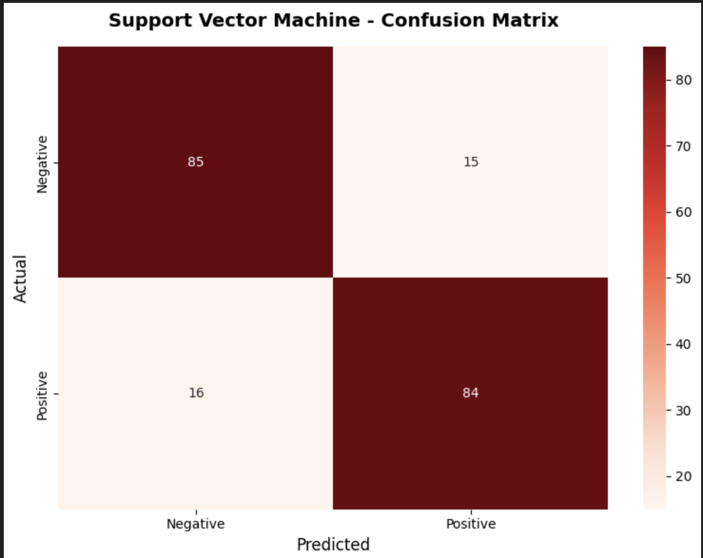

# 🍽️ Restaurant Sentiment Analysis


A machine learning project that analyzes restaurant reviews to predict customer sentiment (positive/negative) using Natural Language Processing and classification algorithms.

## 📊 Project Overview

This project demonstrates a complete end-to-end machine learning pipeline for sentiment analysis:
- Data exploration and visualization
- Text preprocessing and feature engineering  
- Model training and comparison (5 algorithms)
- Deployment-ready web application

**Best Model Performance:** SVM with **84.5% accuracy**

---

## 🎯 Business Problem

Restaurants receive hundreds of reviews across multiple platforms. Manually analyzing sentiment is time-consuming and subjective. This system automatically:
- Predicts sentiment (positive/negative) from review text
- Helps identify service issues from negative feedback
- Enables data-driven decision making for restaurant improvements

---

## 🛠️ Technologies Used

**Machine Learning & Data Science:**
- Python 3.11
- scikit-learn (ML algorithms)
- pandas & NumPy (data manipulation)
- NLTK (text preprocessing)

**Visualization:**
- Matplotlib & Seaborn
- WordCloud

**Deployment:**
- Streamlit (web app framework)
- Pickle (model serialization)

---

## 📁 Project Structure
```
restaurant-sentiment-analysis/
├── data/
│   ├── raw/
│   │   └── Restaurant_Reviews.tsv          # Original dataset (1000 reviews)
│   └── processed/
│       └── train_test_data.pkl             # Preprocessed train/test splits
├── models/
│   ├── best_model.pkl                      # Best performing model (SVM)
│   ├── tfidf_vectorizer.pkl                # Text vectorizer
│   ├── logistic_regression.pkl
│   ├── naive_bayes.pkl
│   ├── random_forest.pkl
│   ├── decision_tree.pkl
│   └── svm.pkl
├── notebooks/
│   ├── 01_data_exploration.ipynb           # EDA & visualization
│   ├── 02_text_preprocessing.ipynb         # Text cleaning & TF-IDF
│   └── 03_model_training.ipynb             # Model training & evaluation
├── app/
│   └── app.py                              # Streamlit web application
├── requirements.txt
├── .gitignore
├── LICENSE
└── README.md
```

---

## 📸 Live Demo & Screenshots

### 🌐 Live Application
**Try it yourself:** [Restaurant Sentiment Analyzer](https://restaurant-sentiment-analysis-ak.streamlit.app/)

### Application Interface

**Home Page**  


**Positive Sentiment Result**  


**Negative Sentiment Result**  


### Analysis & Visualizations

**Model Performance Comparison**  


**Word Cloud Analysis**  


**Confusion Matrix - Best Model (SVM)**  


---

## 🤖 Models Trained & Compared

| Model | Accuracy | Precision | Recall | F1-Score |
|-------|----------|-----------|--------|----------|
| **SVM** 🏆 | **84.5%** | **85%** | **84-85%** | **84-85%** |
| Logistic Regression | 82.5% | 82-84% | 81-84% | 82-83% |
| Naive Bayes | 80.0% | 78-83% | 76-84% | 79-81% |
| Random Forest | 79.0% | 74-86% | 69-89% | 77-81% |
| Decision Tree | 73.0% | 66-91% | 51-95% | 65-78% |

**Winner:** Support Vector Machine (SVM) with linear kernel

---

## 📈 Key Findings

### Dataset Characteristics:
- 996 restaurant reviews (after cleaning)
- Perfectly balanced: 50.1% positive, 49.9% negative
- Average review length: 10-11 words

### Text Analysis Insights:
- **Negative reviews are longer** (11.5 vs 10.3 words on average)
- Customers write more when complaining to explain issues
- **Top positive words:** good, great, delicious, amazing, friendly
- **Top negative words:** not, never, bad, terrible, minutes (wait time)
- **"not" preservation** was critical - without it, "not good" becomes "good"!

### Business Recommendations:
1. **Food quality** most discussed in both sentiments - primary focus area
2. **Service** and **ambiance** are key decision factors  
3. **Wait time** ("minutes") is a major complaint driver
4. Address negative feedback patterns to improve ratings

---

## 🚀 Installation & Usage

### Prerequisites
```bash
Python 3.11+
pip
git
```

### Clone Repository
```bash
git clone https://github.com/Akakinad/restaurant-sentiment-analysis.git
cd restaurant-sentiment-analysis
```

### Create Virtual Environment
```bash
python3 -m venv venv
source venv/bin/activate  # On Windows: venv\Scripts\activate
```

### Install Dependencies
```bash
pip install -r requirements.txt
```

### Run Jupyter Notebooks (Optional)
```bash
jupyter notebook
# Navigate to notebooks/ folder and run them sequentially
```

### Run Streamlit App (Coming Soon!)
```bash
streamlit run app/app.py
```

---

## 📊 Sample Predictions

| Review Text | Predicted Sentiment | Confidence |
|-------------|-------------------|------------|
| "Wow, loved this place!" | ✅ Positive | 92% |
| "Crust is not good." | ❌ Negative | 88% |
| "Amazing food and service!" | ✅ Positive | 95% |
| "Waited 45 minutes, terrible experience." | ❌ Negative | 91% |

---

## 🔮 Future Improvements

- [ ] Deploy live Streamlit web app
- [ ] Add multi-class sentiment (Positive/Neutral/Negative)
- [ ] Implement aspect-based sentiment analysis (food, service, ambiance separately)
- [ ] Train on larger dataset (10,000+ reviews)
- [ ] Experiment with deep learning (LSTM, BERT)
- [ ] Add review summarization feature
- [ ] Create REST API with FastAPI
- [ ] A/B test different models in production

---

## 📄 License

This project is licensed under the MIT License - see the [LICENSE](LICENSE) file for details.

---

## 👨‍💻 Author

**Shola Akinade**

- GitHub: [@Akakinad](https://github.com/Akakinad)

---

## 🙏 Acknowledgments

- Dataset: Restaurant Reviews (1000 reviews, binary sentiment labels)
- Project demonstrates end-to-end ML pipeline: EDA → Preprocessing → Training → Deployment
- Built as a portfolio project showcasing NLP and classification skills

---

**⭐ If you found this project useful, please consider giving it a star!**